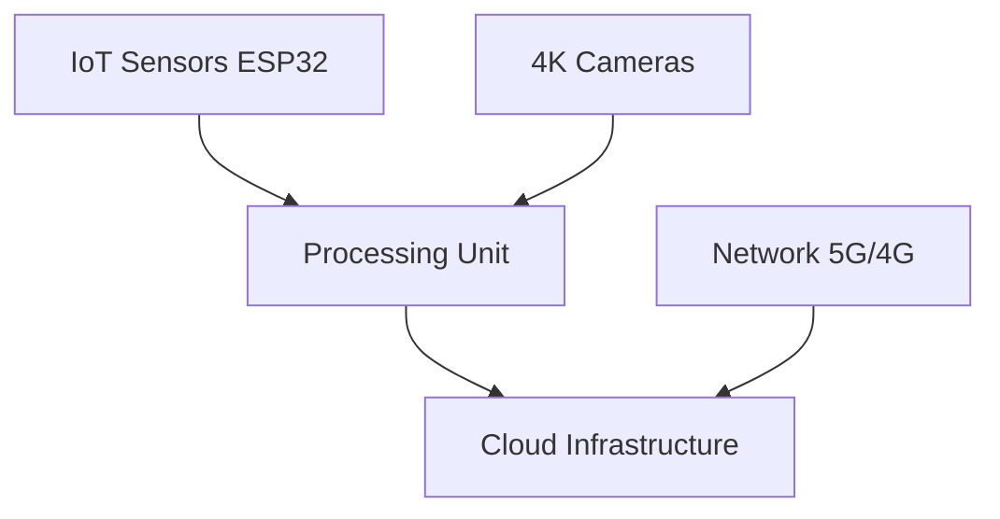

# 🚦 Smart Traffic Monitoring System

An AI and IoT-powered traffic management solution for Indian metropolitan cities

---

### 📊 Key Performance Highlights

- ⏱️ **35%** reduction in wait times
- 🚑 **40%** faster emergency response
- 🚗 **39%** increase in traffic flow
- 🎯 **92%** signal efficiency
- ⚡ **99.95%** system uptime

## 🎯 Core Features

| Feature | Description |
|---------|-------------|
| 🔄 Real-time Monitoring | Live traffic analysis and pattern detection |
| 🧠 AI Signal Control | Smart traffic signal optimization |
| 🚨 Emergency Priority | Automated emergency vehicle routing |
| 🛣️ Dynamic Lanes | Adaptive lane allocation system |
| 📡 V2X Communication | Vehicle-to-everything connectivity |
| 📱 Mobile App | Real-time commuter updates |

## 🛠️ System Architecture

### Hardware Stack

### Software Stack
- 🐧 **OS**: Ubuntu 20.04 LTS
- 🤖 **AI**: TensorFlow 2.x, PyTorch 1.x
- 💾 **DB**: MongoDB, PostgreSQL
- 🔧 **Dev**: Python 3.8+, C++
- ☁️ **Cloud**: AWS/Azure
- 🔒 **Security**: SSL/TLS, OAuth2.0

## 📈 Processing Capabilities

| Metric | Performance |
|--------|-------------|
| Latency | <100ms |
| Video Analysis | 30 FPS |
| Vehicle Detection | >95% accuracy |
| Plate Recognition | >90% accuracy |
| Concurrent Users | 10,000 |
| Storage | 100TB |

## 👥 Team

| Role | Name | Contact |
|------|------|---------|
| Project Mentor | Dr. P.S. Ramesh | drpsramesh@veltech.edu.in |
| Project Lead | Pranshu Chaurasia | vtu21413@veltech.edu.in |
| Developer | Divesh Anand | vtu21414@veltech.edu.in |
| Developer | Kumar Jeevika | vtu23474@veltech.edu.in |

## 🏛️ Institution

**Vel Tech Rangarajan Dr. Sagunthala R&D Institute of Science and Technology**  
Department of Computer Science and Engineering  
Avadi, Chennai 600062, Tamil Nadu, India

---

[📑 Documentation](#) |
[📱 Mobile App](#) |
[🔧 Installation Guide](#) |
[📄 License](#)

